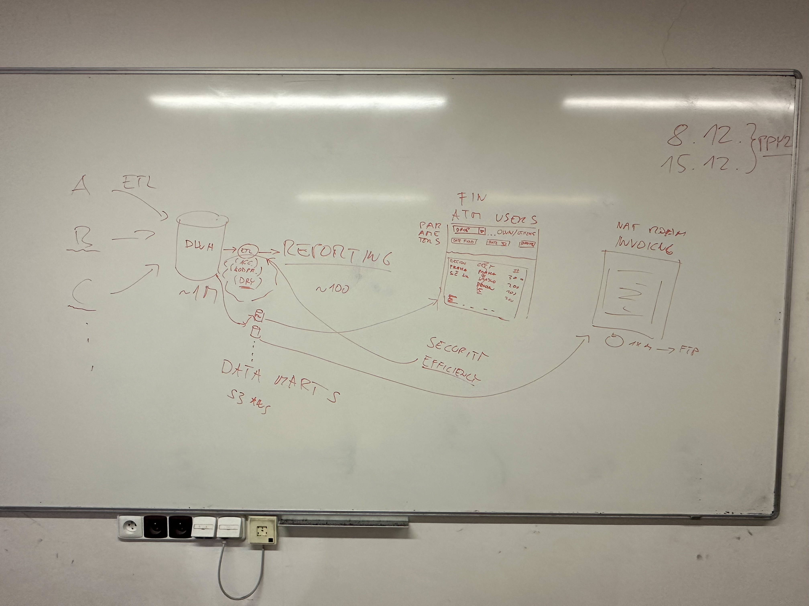

# Lecture #3: Reporting

_November 2 2023_

Reporting layer is typically built on top of the data we have in the Data Warehouse, but aggregated/post-processed into a more efficient and usable data structure. We will focus on these transformations later. For now, let's look into the presentation layer.

Three ways I would recommend on how to deal with it, based on your organization size / structure and budget:

1. Personal / small startup level: Simple & stupid (& cheap!): reporting inside a Jupyter notebook
   * Nice and real-world inspired articles:
     * https://blog.dominodatalab.com/interactive-dashboards-in-jupyter/
     * https://blog.dominodatalab.com/lesser-known-ways-of-using-notebooks/
   * Bonus: handy JavaScript-based pivot table analysis tool – [PivotTableJS](http://nicolas.kruchten.com/pivottable/examples/)
2. Production-level results can be achieved with open source still, eg. by [Dash](https://dash.plotly.com), or [Streamlit](https://streamlit.io), but more engineering/development skills are required
3. Small and Medium Enterprises, with less engineering skills can use e.g. [Microsoft Power BI](https://powerbi.microsoft.com/en-us/), [Tableau](https://www.tableau.com/) or [Good Data](https://www.gooddata.com/) via [Keboola](https://www.keboola.com/)
4. Enterprise level: e.g. [SQL Server Reporting Services](https://docs.microsoft.com/en-us/sql/reporting-services/create-deploy-and-manage-mobile-and-paginated-reports) (SSRS)
   * See **Chapter 10 - Building BI Applications in Reporting Services - A High-Level Architecture for Reporting in the MS DWH Toolkit** — definitely read this one, to understand in full detail what reporting typically means and you will understand the motivation for proper separation of concerns (the data, business logic, presentation layer, the execution back-end) and the ideal tooling

## Notes:

