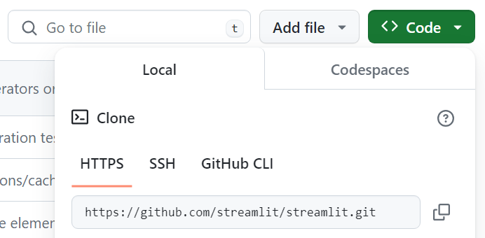

# :rocket: Streamlit
*Disclaimer: Tento materiál není určen jako oficiální dokumentace knihovny [Streamlit](https://github.com/streamlit/streamlit). 
<br>Jedná se pouze o doprovodný materiál k prezentaci předmětu 18BI - Business Intelligence na FJFI.*
## Co je to Streamlit?
Streamlit je open-source framework pro tvorbu datových aplikací v Pythonu.
## Proč používat Streamlit?
* Jednoduchost
  * Stručná intuitivní syntax
  * Nepotřebujete být frontenďák 
* Rychlost
  * Real-time preview při editaci
  * Deploy na [Streamlit Cloud](https://streamlit.io/cloud) do 3 minut
* Open-source
* Komunita (+ [Community Cloud](https://streamlit.io/cloud))
* Integrace s ostatními nástroji

## :thinking: Kde začít?
Pokud nejste úplní nováčci v Pythonu a Gitu, můžete přeskočit na [Hello World](#hello-world).


### :octocat: Setup repozitáře 
*Pozn.: Pokud jste nikdy nepracovali s Gitem, doporučuji si přečíst [tento článek](https://docs.github.com/en/get-started/using-git/about-git).*
1. Vytvořte si na GitHubu účet, pokud ho ještě nemáte.
2. Vytvořte si [nový repozitář](https://docs.github.com/en/repositories/creating-and-managing-repositories/creating-a-new-repository).
3. Nainstalujte si Git na svůj počítač - [Windows](https://git-scm.com/download/win), [Mac](https://git-scm.com/download/mac), [Linux](https://git-scm.com/download/linux)
    - Pomoc s přihlášením atd. je v sekcích 2 a 3 [dokumentace](https://docs.github.com/en/get-started/getting-started-with-git/set-up-git#setting-up-git). 
4. Ve svém oblíbeném terminálu naklonujte repozitář pomocí `git clone <url>`. Clone url najdete tady:<br>
<br>
*Pozn.: Silně doporučuji si nastavit a používat [SSH klíč](https://docs.github.com/en/github/authenticating-to-github/connecting-to-github-with-ssh)*
5. V terminálu se přesuňte do složky s repozitářem pomocí `cd <repo-name>`.

### :snake: Setup Pythonu
*Pozn.: Pokud nemáte žádné zkušeností Pythonem, doporučuji si přečíst [tento článek](https://realpython.com/python-first-steps/).*
- Windows - [python.org](https://www.python.org/downloads/windows/) nebo přes Microsoft Store
- Mac - [python.org](https://www.python.org/downloads/mac-osx/) nebo přes Homebrew
- Linux - `sudo apt-get install python3.12` (případně jinou verzi)

Zkuste pustit `python --version` v terminálu. Pokud se vám vypíše verze Pythonu, máte ho nainstalovaný správně.
Pokud ne, dumpněte error do Chat-GPT :wink:.

### :snake: Setup virtuálního prostředí
*Pozn.: Pokud nevíte co je to virtuální prostředí, doporučuji si přečíst [tento článek](https://realpython.com/python-virtual-environments-a-primer/).*
1. V terminálu se přesuňte do složky s repozitářem pomocí `cd <repo-name>`.
2. Vytvořte si virtuální prostředí pomocí `python -m venv .venv`.
3. Aktivujte si virtuální prostředí pomocí `.\.venv\Scripts\activate` (Windows) nebo `source ./.venv/bin/activate` (Mac/Linux).
4. Nainstalujte streamlit pomocí `pip install streamlit`.
5. Otestujte spuštění pomocí `streamlit hello`. Pokud se vám otevře okno s aplikací, máte všechno správně nastavené.

## Hello World
1. V terminálu se přesuňte do složky s repozitářem pomocí `cd <repo-name>`.
2. Vytvořte si nový soubor `app.py` a otevřete ho ve svém oblíbeném [textovém editoru](https://neovim.io/) nebo [IDEčku](https://www.jetbrains.com/pycharm/).
3. Konečně se dostáváme k prvnímu přikladu! :clap:
```python
import streamlit as st # Importujeme streamlit pod aliasem st
st.write("Hello World!") # Vypíšeme na obrazovku Hello World!
```
4. :rocket: Spusťte aplikaci pomocí `streamlit run app.py` :rocket:

# Další příklady
Ukázky z prezentace:<br>
https://github.com/streamlit/snowflake-usage-app<br>
https://github.com/streamlit/demo-uber-nyc-pickups/tree/main<br>
https://github.com/streamlit/demo-deepdream<br>
https://github.com/streamlit/streamlit-buffett<br>
https://github.com/streamlit/example-app-bert-keyword-extractor<br>

# Deploy na Streamlit Cloud
1. Vytvořte si účet na [Streamlit Cloud](https://streamlit.io/cloud).
2. Propojte si svůj GitHub účet s účtem na Streamlit Cloud.
3. Klikněte na tlačítko `New app`.
4. Vyberte si repozitář a branch, ze kterého chcete deployovat.
6. Vyberte si soubor, který chcete spustit (v našem případě `app.py`).
7. Zvolte si doménu a klikněte na `Deploy`.
8. Počkejte až se vám aplikace nasadí a otevře se vám v prohlížeči.
9. :rocket: Gratuluji! :rocket:

:point_up: Pokud upravíte soubor `app.py` a pushnete změny na GitHub, aplikace se vám automaticky znovu nasadí.

*Pozn.: V nastavení aplikace si můžete nastavit Sharing (Only specific people can view this app , This app is public and searchable)*
